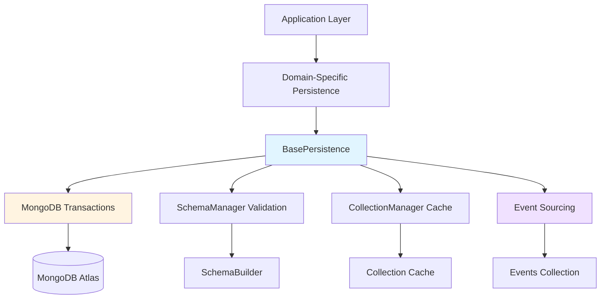
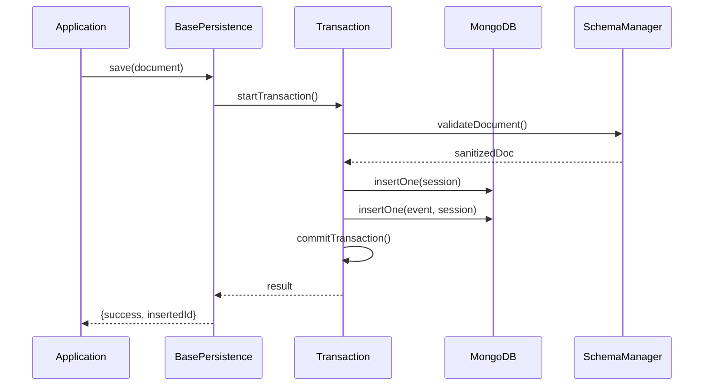
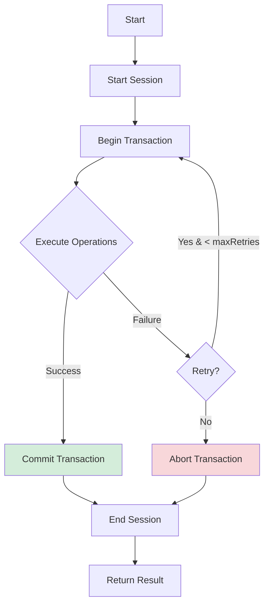
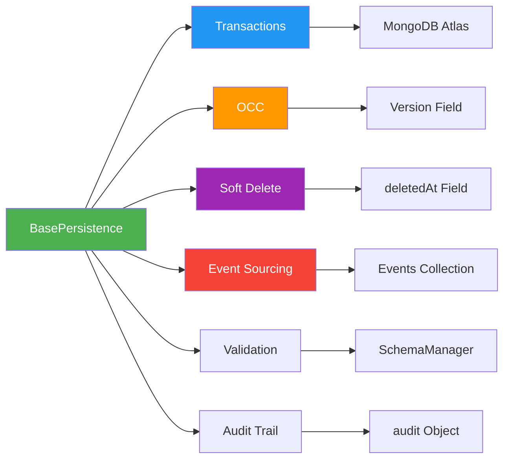

# BasePersistence - Universal Atomic Persistence Layer

A powerful, framework-agnostic persistence layer that provides **atomic operations** with MongoDB Transactions,
 Optimistic Concurrency Control (OCC), Soft Delete, and Event Sourcing capabilities.

## 🎯 Overview

`BasePersistence` is a universal base class designed to handle all database operations atomically.
 It eliminates the need to write repetitive transaction handling code for every collection in your application.

### Key Features

- ✅ **Atomic Transactions** - All operations are wrapped in MongoDB Transactions with automatic retry
- ✅ **Optimistic Concurrency Control (OCC)** - Prevents concurrent modification conflicts
- ✅ **Soft Delete** - Logical deletion with `deletedAt` timestamp
- ✅ **Event Sourcing** - Optional audit trail for all changes
- ✅ **Framework Integration** - Seamless integration with your Framework Core
- ✅ **Schema Validation** - Automatic validation via `schemaManager`
- ✅ **Audit Trail** - Automatic tracking of who created/updated/deleted documents

## 🏗️ Architecture



### Data Flow



## 📦 Installation

```bash
# No installation needed - part of Framework Core
```

## 🚀 Quick Start

### 1. Create Domain-Specific Persistence Class

```javascript
// src/rbac/persistence/RBACPersistence.js
import { BasePersistence } from "../../framework/persistence/BasePersistence.js";

export class RBACPersistence extends BasePersistence {
    constructor() {
        super({
            collectionName: "rbac_roles",
            eventsCollectionName: "rbac_events",
            enableEventSourcing: true,
            enableAuditTrail: true,
           
        });
    }

    async saveRole(roleName, roleDefinition,userContext= {role:["admin"]}) {
        return await this.save(
            { roleName, roleDefinition, status: "active" },
            { userContext }
        );
    }
}
```

### 2. Use in Your Application example 

```javascript
import { rbacPersistence } from "./rbac/persistence/RBACPersistence.js";

// Save a new role
const result = await rbacPersistence.saveRole(
    "ADMIN_ROLE",
    { /* role definition */ },
    "admin_user"
);

// Update with automatic version check
await rbacPersistence.update(
    { roleName: "ADMIN_ROLE" },
    { roleDefinition: newDefinition },
    { userContext: role:["admin_user"]}
);

// Soft delete
await rbacPersistence.delete(
    { roleName: "ADMIN_ROLE" },
    { userContext: role:["admin_user"] , hardDelete : false}
);
```

## 🔧 Configuration Options

### Constructor Options

| Option | Type | Default | Description |
|--------|------|---------|-------------|
| `collectionName` | `string` | **required** | Name of the MongoDB collection |
| `eventsCollectionName` | `string` | `null` | Name of events collection (for Event Sourcing) |
| `enableEventSourcing` | `boolean` | `false` | Enable audit trail in events collection |
| `enableAuditTrail` | `boolean` | `true` | Add `audit` field to documents |


### Method Options

#### `save(document, options)`

| Option | Type | Default | Description |
|--------|------|---------|-------------|
| `userContext ` | `object` | `{role:[]}` | Who is performing the operation |
| `metadata` | `object` | `{}` | Additional metadata for events |


#### `update(filter, update, options)`

| Option | Type | Default | Description |
|--------|------|---------|-------------|
| `userContext ` | `object` | `{role:[]}` | Who is performing the operation |
| `metadata` | `object` | `{}` | Additional metadata for events |
| `skipVersionCheck` | `boolean` | `false` | Skip OCC version check |


#### `delete(filter, options)`

| Option | Type | Default | Description |
|--------|------|---------|-------------|
| `userContext ` | `object` | `{role:[]}` | Who is performing the operation |
| `hardDelete` | `boolean` | `false` | Permanently delete instead of soft delete |

## 📖 API Reference

### Core Methods

#### `save(document, options)`
Creates a new document atomically.

```javascript
const result = await persistence.save(
    { name: "John", email: "john@example.com" },
   userContext = { role: [] }
);
// Returns: { success: true, insertedId: ObjectId, version: 1 }
```

#### `update(filter, update, options)`
Updates an existing document with OCC protection.

```javascript
const result = await persistence.update(
    { email: "john@example.com" },
    { name: "John Doe" },
    {userContext = { role: [] }}
);
// Returns: { success: true, matchedCount: 1, modifiedCount: 1, previousVersion: 1, newVersion: 2 }
```

#### `delete(filter, options)`
Deletes a document (soft or hard).

```javascript
const result = await persistence.delete(
    { email: "john@example.com" },
    { actor: "admin", hardDelete: false }
);
// Returns: { success: true, deletedCount: 1, hardDelete: false }
```

#### `load(filter, options)`
Loads a single document.

```javascript
const result = await persistence.load(
    { email: "john@example.com" },
    { includeDeleted: false }
);
// Returns: { success: true, data: {...} }
```

#### `loadAll(filter, options)`
Loads multiple documents.

```javascript
const result = await persistence.loadAll(
    { status: "active" },
    { limit: 100, sort: { createdAt: -1 } }
);
// Returns: { success: true, data: [...], count: 42 }
```

#### `exists(filter)`
Checks if a document exists.

```javascript
const exists = await persistence.exists({ email: "john@example.com" });
// Returns: true or false
```

#### `getHistory(documentId, limit)`
Retrieves event history (if Event Sourcing enabled).

```javascript
const history = await persistence.getHistory(documentId, 50);
// Returns: { success: true, data: [...events] }
```

### Transaction Helper

#### `withTransaction(operations, options)`
Executes operations atomically with automatic retry.

```javascript
const result = await persistence.withTransaction(async (session) => {
    const coll = await persistence.getCollection();
    
    await coll.insertOne({ name: "Doc 1" }, { session });
    await coll.insertOne({ name: "Doc 2" }, { session });
    
    return { success: true };
}, { maxRetries: 3 });
```

## 🔄 Transaction Flow



## 🛡️ Error Handling

All methods return structured error responses:

```javascript
// Success
{ success: true, data: {...} }

// Failure
{
    success: false,
    code: 404,
    message: "Document not found"
}
```

### Common Error Codes

| Code | Description |
|------|-------------|
| `400` | Validation error |
| `404` | Document not found |
| `409` | Concurrent modification (OCC conflict) |
| `500` | Internal server error |

## 📊 Event Sourcing

When `enableEventSourcing` is `true`, all changes are recorded in the events collection:

```javascript
{
    eventType: "DOCUMENT_UPDATED",
    collectionName: "rbac_roles",
    documentId: ObjectId("..."),
    previousVersion: 1,
    newVersion: 2,
    previousDocument: { /* old data */ },
    newDocument: { /* new data */ },
    actor: "admin_user",
    timestamp: ISODate("2026-09-08T10:30:00Z"),
    metadata: { reason: "Updated permissions" }
}
```

## 🔒 Security Features

### Optimistic Concurrency Control (OCC)

Prevents lost updates when multiple clients modify the same document:

```javascript
// Client 1 reads document (version: 1)
// Client 2 reads document (version: 1)
// Client 1 updates (version: 1 → 2) ✅ Success
// Client 2 updates (version: 1 → 2) ❌ Fails with 409 Conflict
```

### Soft Delete

Documents are marked as deleted but remain in the database:

```javascript
// Before delete
{ _id: 1, name: "John", deletedAt: null }

// After soft delete
{ _id: 1, name: "John", deletedAt: ISODate("2026-09-08T10:30:00Z") }
```

## 🧪 Testing

```javascript
import { describe, it, beforeEach } from 'node:test';
import assert from 'node:assert';
import { BasePersistence } from './BasePersistence.js';

describe('BasePersistence', () => {
    let persistence;

    beforeEach(() => {
        persistence = new BasePersistence({
            collectionName: 'test_collection',
            enableEventSourcing: true
        });
    });

    it('should save document atomically', async () => {
        const result = await persistence.save({ name: 'Test' });
        assert.strictEqual(result.success, true);
        assert.ok(result.insertedId);
    });

    it('should handle OCC conflicts', async () => {
        // Simulate concurrent updates
        // ...
    });
});
```

## 📝 Best Practices

1. **Always use domain-specific subclasses** - Don't use `BasePersistence` directly
2. **Enable Event Sourcing for critical data** - Roles, permissions, financial records
3. **Use OCC for user-generated content** - Prevents lost updates
4. **Prefer soft delete** - Allows data recovery and audit
5. **Pass `userContext` consistently** 
6. **Handle 409 errors gracefully** - Retry or notify user

## 🐛 Troubleshooting

### Transaction Timeout

**Problem:** Transactions timeout after 60 seconds

**Solution:** Keep transactions short. Don't include long-running operations.

### OCC Conflicts

**Problem:** Frequent 409 errors

**Solution:** Implement retry logic or reduce concurrent updates.

### Event Sourcing Storage

**Problem:** Events collection grows too large

**Solution:** Implement archival strategy (move old events to archive collection).


## 📄 License

Part of Framework Core - Internal Use Only

## 🤝 Contributing

1. Follow the existing code style
2. Add tests for new features
3. Update documentation
4. Submit pull request

---

## 📊 Summary Diagram



---

