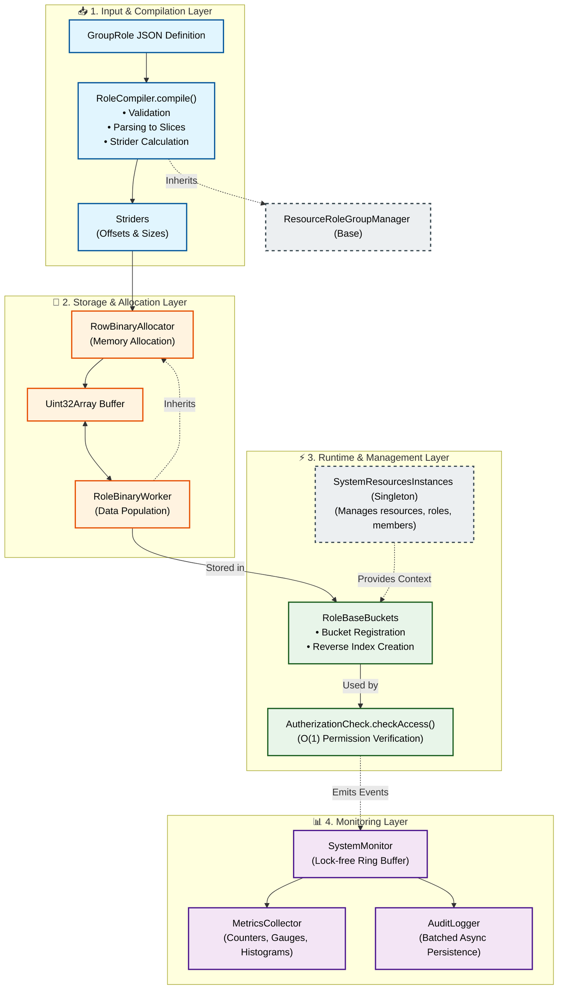
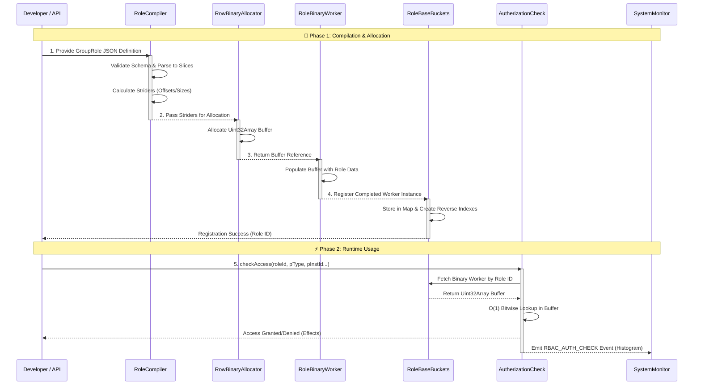
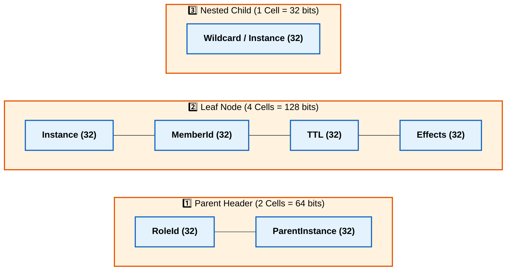

# 🚀 High-Performance Binary RBAC System

An advanced, sub-microsecond Role-Based Access Control (RBAC) engine that uses **direct Binary Storage (`Uint32Array`)** to achieve ultra-high performance, replacing traditional heavy JSON object evaluations with lightning-fast bitwise memory reads.

## ✨ Core Features
- ⚡ **Instant O(1) Access**: Direct memory offset calculation for any permission check.
- 💾 **Smart Memory Usage**: Contiguous `Uint32Array` buffers eliminate JavaScript object overhead and GC pressure.
- 🌐 **Intelligent Wildcard Support**: Native `0xFFFFFFFF` marker for broad, efficient permission delegation.
- 🔄 **Atomic Hot-Swap**: Update role definitions in production with zero downtime.
- ⚙️ **Background Processing**: Asynchronous compilation and memory allocation for heavy operations.
- 🛡️ **Strict Multi-Stage Validation**: Prevents invalid hierarchies, duplicate instances, and malformed TTLs before memory allocation.

## 🎯 Why This System?
| Metric | Traditional RBAC | Binary RBAC Engine |
| :--- | :--- | :--- |
| **Check Latency** | 1–5 ms (Object traversal) | **< 100 ns** (Bitwise memory read) |
| **Memory Footprint** | High (Heavy JSON objects) | **10–100x smaller** (Raw 32-bit integers) |
| **Concurrency** | Lock contention on shared state | **Lock-free**, per-role isolated buffers |
| **Updates** | Requires cache invalidation/reload | **Atomic pointer swap** (Zero downtime) |

---

## 🏗️ System Architecture

The system consists of **4 fundamental layers** working in perfect harmony:



---

## 🔄 GroupRole Lifecycle Sequence



---

## 🧠 Core Design Principle: Separation of Concerns

| Phase | Class | Responsibility |
| :--- | :--- | :--- |
| **Definition (Static)** | `RoleCompiler` | Computes the plan: Validation, Parsing, and Strider (Offset/Size) calculation. |
| **Execution (Dynamic)** | `RoleBinaryWorker` | Executes the plan: Allocates memory and populates the `Uint32Array` buffer. |
| **Management (Runtime)**| `RoleBaseBuckets` | Manages active instances, reverse indexing, and atomic hot-swapping. |

*This separation enables zero-downtime updates, fault isolation, and independent testing of each component.*

---

## 💾 Binary Storage Philosophy

⚠️ **Critical Design Choice:** Each GroupRole has its **own separate `Uint32Array` Buffer**. Roles do *not* share a global buffer.

```text
┌─────────────────────────────────────────────────────────────┐
│ RoleBaseBuckets.insBucket (Map)                             │
│  ┌──────────────────────────────────────────────────────┐   │
│  │ RoleId: 1 → RoleBinaryWorker #1  └─→ buffer: Uint32Array(1024) │
│  ├──────────────────────────────────────────────────────┤   │
│  │ RoleId: 2 → RoleBinaryWorker #2  └─→ buffer: Uint32Array(512)  │
│  ├──────────────────────────────────────────────────────┤   │
│  │ RoleId: 3 → RoleBinaryWorker #3  └─→ buffer: Uint32Array(2048) │
│  └──────────────────────────────────────────────────────┘   │
└─────────────────────────────────────────────────────────────┘
```

### Why Separate Buffers?
1. **Complete Isolation**: An error or corruption in one role's buffer cannot affect others.
2. **Atomic Hot-Swap**: You can rebuild and swap one role's buffer instantly while others continue serving requests.
3. **Flexible Memory**: Each buffer is sized exactly to the role's requirements (no massive, sparse global arrays).
4. **Cache Efficiency**: Small, cohesive buffers fit perfectly into CPU L1/L2 caches, maximizing read speed.

---

## 🧬 Core Memory Units (Within Each Buffer)

Every cell in the buffer is exactly **32 bits (4 bytes)**.



### Detailed Cell Breakdown
| Unit | Size | Contents | Description |
| :--- | :---: | :--- | :--- |
| **Parent Header** | 2 Cells | `[RoleId, ParentInstance]` | Identifies the role and the parent resource instance. |
| **Leaf Node** | 4 Cells | `[Instance, MemberId, TTL, Effects]` | Holds the actual permission data. *Always 4 cells, whether Child or GrandChild.* |
| **Nested Child** | 1 Cell | `[Wildcard / Instance]` | Acts as a "passage" to reach a GrandChild. Exists *only* when a GrandChild is present. |

---

## 📐 Two Possible Structure Cases

### Case 1: Direct Child Leaf (No GrandChild)
*Total Size = 6 Cells*
```text
┌────────────────────────────────────────────┐
│ Parent Header (2) │ Child Leaf (4)         │
│ [RoleId, ParIns]  │ [Ins, Mem, TTL, Eff]   │
└────────────────────────────────────────────┘
```

### Case 2: Nested Child + GrandChild Leaf
*Total Size = 7 Cells*
```text
┌──────────────────────────────────────────────────────┐
│ Parent (2) │ Nested Child (1) │ GrandChild Leaf (4)  │
│ [RoleId,   │ [Wildcard/Ins]   │ [Ins, Mem, TTL, Eff] │
│  ParIns]   │                  │                      │
└──────────────────────────────────────────────────────┘
```

---

## 🧮 The Golden Formula for O(1) Access

To read any cell within a role's buffer, the engine uses a deterministic mathematical formula:

```javascript
address = shift + striderOffset[type] + (striderSize[type] × instanceIndex)
```

| Element | Meaning | Example |
| :--- | :--- | :--- |
| `shift` | Start point of the ParentInstance block within the buffer. | `0` for first Parent, `15` for second. |
| `striderOffset[type]` | Internal offset to reach the specific Resource type. | `0` for Parent, `2` for Child Leaf. |
| `striderSize[type]` | Resource block size (how many cells it occupies). | `2` for Parent, `4` for Leaf. |
| `instanceIndex` | The requested instance number. | `0`, `1`, `2`, ... |

### Practical Example: Accessing the 2nd GrandChild Leaf
```text
Buffer for GroupRole "ADMIN_ROLE":
 Parent Instance 0 (shift = 0)
  ├─ Parent Header (offset=0, size=2): [RoleId, ParIns]
  ├─ Child Leaf     (offset=2, size=4): [Ins, Mem, TTL, Eff]
  ├─ Nested Child   (offset=6, size=1): [Wildcard]
  ├─ GrandChild 0   (offset=7, size=4): [Ins, Mem, TTL, Eff]
  └─ GrandChild 1   (offset=11, size=4): [Ins, Mem, TTL, Eff]  ← TARGET

Calculation: address = 0 (shift) + 7 (offset) + (4 (size) × 1 (index)) = 11

Reading:
  worker.buffer[11] = Instance
  worker.buffer[12] = MemberId
  worker.buffer[13] = TTL
  worker.buffer[14] = Effects
```

---

## 🃏 Wildcard as a Marker (Not an Index)

The system uses `4294967295` (`0xFFFFFFFF`) as a special numeric marker for wildcards, avoiding string comparisons entirely.

```text
┌─────────────────────────────────────────────────────────────┐
│ Case 1: Wildcard Marker in Leaf Node                        │
│ Buffer: [4294967295, 1, 1787618024, 4259861]                │
│          ↑                                                  │
│     Wildcard marker (means: applies to ALL instances)       │
│                                                             │
│ Request: checkAccess(roleId, parentId, instance=5)          │
│ Result: ✅ Allowed (Engine detects 0xFFFFFFFF and bypasses) │
├─────────────────────────────────────────────────────────────┤
│ Case 2: Specific Instance in Leaf Node                      │
│ Buffer: [1, 2, 1787618024, 65]                              │
│          ↑                                                  │
│     Specific instance (means: applies to instance 1 only)   │
│                                                             │
│ Request: checkAccess(roleId, parentId, instance=1)          │
│ Result: ✅ Allowed (1 === 1)                                │
└─────────────────────────────────────────────────────────────┘
```

---

## ⚙️ The 6-Phase Data Flow

1. **JSON Definition**: User provides plain JSON. No memory allocated yet.
2. **Validation (`parsedGroupRoleValidation`)**: Checks `TYPE_IDS`, hierarchy (`RESOURCES_CHILD`), wildcard mixing, and non-empty arrays. *Fails fast if invalid.*
3. **Parsing (`parsedGroupRole`)**: Registers members, converts TTL to Unix timestamps, builds `SchemaSlices`, and populates the `_pathsBuffer`.
4. **Strider Calculation (`calculateTotalStridersSchemaSlice`)**: Computes exact `striderSize` and `striderOffset` for every node, determining the final `totalBytesSize`.
5. **Buffer Population (`RowBinaryAllocator` + `RoleBinaryWorker`)**: Allocates the `Uint32Array` and writes the 32-bit cells sequentially based on the strider map.
6. **Runtime (`AutherizationCheck`)**: Fetches the worker, calculates the address using the Golden Formula, reads the 4 cells, checks TTL, and returns the bitwise `Effects`.

---

## 🧱 Philosophy of Constants

In high-performance systems, string comparison is a "performance killer." This system relies entirely on **Integers** and **Static Maps**.

| Constant Map | Purpose | Example |
| :--- | :--- | :--- |
| **`TYPE_IDS`** | Maps resource names to unique numeric PIDs. | `COLLECTIONS: 100`, `DOCUMENTS: 101` |
| **`TYPE_ID_TAG`** | Identifies resources that require an `ownerInstance`. | `[100]: 10000` |
| **`RESOURCES_CHILD`** | The "Law of Parenthood". Defines valid hierarchies. | `Map([10, Set([11])])` (Article → Post) |
| **`STRIDER_SIZES`** | The memory map governing cell sizes. | `PARENT: 2`, `CHILD: 4`, `NESTED: 1` |
| **`SYSTEM_STATUS`** | Standardized numeric error codes. | `INVALID_RESOURCE_PID: -11` |

### Bitmasking for Actions & Boundaries
Permissions are compressed into a single **32-bit `Effects` cell**:
- **Least Significant 2 Bytes**: Primary `action` (READ=1, WRITE=2) + `boundary` (OWN=16, ALL=64).
- **Most Significant 2 Bytes**: Delegated `actionToOthers` + `boundaryToOthers`.

```javascript
// Example: READ (1) | OWN (16) = 17
// Shifted for delegation: (WRITE (2) | ALL (64)) << 16 = 4325376
// Total Effect = 4325376 | 17 = 4325393
```

---

## 🚀 Quick Start & API Reference

### 1. Initialize the System
```javascript
import { rbacManager } from './rbac/RBAC are
```

---

## 📚 Full API Reference

*(Due to length, refer to the detailed API section in the original draft. Key highlights below)*

### Core Classes
- **`SystemResourcesInstances`**: Singleton managing resource/role/member registration.
- **`RoleCompiler`**: Transforms JSON → Validation → Slices → Striders.
- **`RowBinaryAllocator`**: Parent class allocating the `Uint32Array` buffer.
- **`RoleBinaryWorker`**: Populates the buffer and provides `geteffectedAccess()` read interfaces.
- **`RoleBaseBuckets`**: Manages active instances, reverse indexing, and `updateExistedInstanceRole()` (Hot-Swap).
- **`AutherizationCheck`**: The O(1) permission verification engine.

---

## ⚠️ Best Practices & Common Mistakes

| ✅ Best Practice | ❌ Common Mistake |
| :--- | :--- |
| **Use Wildcards Wisely**: `parentInstance: ["*"]` for broad access. | Mixing `"*"` with specific instances: `["*", 0, 1]` (Rejected by validation). |
| **Set Realistic TTLs**: Use `"24h"` for temp access, `null` for permanent. | Using `"999d"` for "temporary" access. |
| **Respect Hierarchy**: Follow `RESOURCES_CHILD` rules strictly. | Trying to make a Leaf resource (e.g., `COMMENT`) a parent. |
| **Minimize Instances**: Fewer instances = smaller, faster buffers. | Defining 1,000 specific instances instead of one `"*"` wildcard. |
| **Use Dedicated APIs**: `worker.setWorkerValueToAddr()` | Directly mutating `worker.buffer[10] = 999` (Corrupts memory). |

---

## 📊 Performance Monitoring

The system is fully instrumented with the Framework's Ring Buffer `MonitoringSystem`.

```javascript
import { initializeMonitoring, getMetricsSnapshot } from "./monitoring/index.js";

initializeMonitoring({ enabled: true, auditEnabled: true, logFilePath: './logs/audit.jsonl' });

// Display metrics every 10 seconds
setInterval(() => {
    const snapshot = getMetricsSnapshot();
    console.log('Auth Checks:', snapshot.metrics.counters['rbac.access.check.total']);
    console.log('Avg Check Time:', snapshot.metrics.histograms['rbac.access.check.duration'].avg);
    console.log('Queue Size:', snapshot.monitor.queueSize);
}, 10000);
```

### 🎯 Critical Metrics Thresholds
| Metric | Ideal Value | Action if Exceeded |
| :--- | :--- | :--- |
| **Avg Check Time** | `< 100 ns` | Review role structure for excessive nesting. |
| **Buffer Size** | `< 10 KB` per role | Reduce instance count; use wildcards. |
| **Compile Time** | `< 10 ms` | Review Validation logic for large JSON payloads. |
| **Hot-Swap Time** | `< 50 ms` | Normal. If higher, check background worker load. |

---

**Version:** 1.0.0  
**Last Updated:** 2026-09-11  
**Author:** Framework Core Team  
**Related Docs:** [ADR-017: Binary-Compiled RBAC Engine](./../../doc/adr/017-rbac-system.md)

---

## 🚀 How to Use It (Practical Examples)

This section provides step-by-step, real-world examples of how to integrate and operate the Binary RBAC Engine in your application.

### 1️⃣ Initialize the System
Always initialize the RBAC Manager during your application's bootstrap phase (e.g., in `app.js` or `server.js`). This also wires it into your Monitoring System.

```javascript
import { rbacManager } from './rbac/RBACManager.js';
import { initializeMonitoring } from './Monitoring/monitoringSystem.js';

// 1. Initialize Monitoring (Optional but recommended)
initializeMonitoring({
    enabled: true,
    auditEnabled: true,
    logFilePath: './logs/rbac-audit.jsonl'
});

// 2. Initialize RBAC Manager
rbacManager.initialize({
    monitoring: { enabled: true }
});

console.log('✅ RBAC System is ready!');
```

---

### 2️⃣ Register Resources & Instances
Before creating roles, you must define the resource hierarchy and their specific instances in the system.

```javascript
// Register Parent Resource: COLLECTIONS
rbacManager.registerResource('COLLECTIONS', ['users_collection', 'posts_collection', 'metrics_collection']);

// Register Child Resource: SEARCH_INDEXES
rbacManager.registerResource('SEARCH_INDEXES', ['idx_user_email', 'idx_post_title']);

// Verify registration
const usersCollIndex = rbacManager.getregisterResource('COLLECTIONS', 'users_collection');
console.log('Users Collection Index:', usersCollIndex); // e.g., 0
```

---

### 3️⃣ Create a Role (Simple: Direct Child Leaf)
Define a role using a JSON structure. The manager will automatically compile it into a binary buffer and register it.

```javascript
const editorRoleDefinition = {
    "editor_member": {
        "SEARCH_INDEXES": {
            parentResource: "COLLECTIONS",
            parentInstance: ["users_collection"], // Specific parent instance
            action: ["READ", "UPDATE"],
            boundary: "OWN",
            actionToOthers: ["READ"],             // Delegation: Can let others read
            boundaryToOthers: "ALL",              // Delegation scope: To anyone
            ownerInstance: ["*"],                 // Applies to all owners
            ttl: null,                            // Permanent permission
            nested: null,                         // No grandchild
            nestedInstance: null
        }
    }
};

const result = rbacManager.createRole("EDITOR_ROLE", editorRoleDefinition);

if (result.success) {
    console.log(`✅ Role created! Role ID: ${result.roleId}`);
} else {
    console.error(`❌ Failed: ${result.message}`);
}
```

---

### 4️⃣ Check Access (Runtime Authorization)
Use `checkAccess` in your middleware or service layer. It performs an **O(1) bitwise lookup** in nanoseconds.

```javascript
import { DEFAULT_ACTIONS } from './rbac/constant/resourceType.js';

// Assume we fetched the user's roleId from their JWT token
const userRoleId = rbacManager.getregisterResource('ROLES', 'EDITOR_ROLE'); // Or however you map names to IDs
const parentType = 100; // TYPE_IDS.COLLECTIONS
const parentInstance = 0; // Index of 'users_collection'
const childType = 102;    // TYPE_IDS.SEARCH_INDEXES
const childInstance = 0;  // Index of 'idx_user_email'

// 1. Perform the O(1) check
const accessEffect = rbacManager.checkAccess(
    userRoleId, 
    parentType, 
    parentInstance, 
    childType, 
    childInstance, 
    null, // grandChildType
    null  // grandChildInstance
);

// 2. Evaluate the result
if (typeof accessEffect === 'object' && accessEffect.code) {
    // Access Denied
    console.log(`🚫 Access Denied: ${accessEffect.message}`);
} else {
    // Access Granted! Check if the specific action is allowed
    const canRead = rbacManager.AllowedPrimaryTarget(accessEffect, DEFAULT_ACTIONS.READ);
    const canUpdate = rbacManager.AllowedPrimaryTarget(accessEffect, DEFAULT_ACTIONS.UPDATE);
    
    console.log(`✅ Access Granted! Can Read: ${canRead}, Can Update: ${canUpdate}`);
    
    // Check delegation (Can they let others read?)
    const canDelegateRead = rbacManager.AllowedTargetToOthers(accessEffect, DEFAULT_ACTIONS.READ);
    console.log(`🤝 Can delegate READ to others: ${canDelegateRead}`);
}
```

---

### 5️⃣ Atomic Hot-Swap (Zero-Downtime Update)
Update a role's permissions in production without restarting the server or blocking active requests.

```javascript
const updatedEditorDefinition = {
    "editor_member": {
        "SEARCH_INDEXES": {
            parentResource: "COLLECTIONS",
            parentInstance: ["users_collection", "posts_collection"], // ➕ Added posts_collection
            action: ["READ", "UPDATE", "DELETE"],                    // ➕ Added DELETE
            boundary: "OWN",
            actionToOthers: ["READ"],
            boundaryToOthers: "ALL",
            ownerInstance: ["*"],
            ttl: null,
            nested: null,
            nestedInstance: null
        }
    }
};

// Perform Atomic Hot-Swap
const updateResult = rbacManager.updateRole("EDITOR_ROLE", updatedEditorDefinition);

if (updateResult.success) {
    console.log('✅ Role updated instantly! Old buffer discarded, new buffer active.');
}
```

---

### 6️⃣ Safe Resource Deletion
The system prevents you from deleting a resource instance if it is actively bound to an existing role, preventing orphaned permissions.

```javascript
// Attempt to delete 'users_collection'
const deleteResult = rbacManager.deleteInstance('COLLECTIONS', 'users_collection');

if (!deleteResult.success && deleteResult.code === -17) { // SYSTEM_STATUS.INSTANCE_NOT_ALLOWED
    console.warn(`⚠️ Cannot delete: ${deleteResult.message}`);
    console.log(`Active roles blocking deletion: ${deleteResult.roleNames.join(', ')}`);
    
    // Resolution: Update or delete the blocking roles first, then retry.
} else {
    console.log('✅ Instance deleted successfully.');
}
```

---

### 7️⃣ Monitoring & Auditing in Action
Because the system is deeply integrated with the `MonitoringSystem`, you can pull real-time metrics and audit logs.

```javascript
import { getMetricsSnapshot, getMonitoringHealthStatus } from './Monitoring/monitoringSystem.js';

// 1. Check System Health
const health = getMonitoringHealthStatus();
console.log('RBAC Health:', health.status, `| Uptime: ${health.uptime}ms`);

// 2. Get Performance Metrics
const snapshot = getMetricsSnapshot();

console.log('\n📊 RBAC Performance Metrics:');
console.log(`Total Auth Checks: ${snapshot.metrics.counters['rbac.access.check.total'] || 0}`);
console.log(`Auth Denied Count: ${snapshot.metrics.counters['rbac.access.check.denied'] || 0}`);

const durationHist = snapshot.metrics.histograms['rbac.access.check.duration'];
if (durationHist) {
    console.log(`Avg Check Time: ${durationHist.avg}`); // e.g., "0.045μs"
    console.log(`99th Percentile: ${durationHist.p99}`); // e.g., "0.120μs"
}

console.log(`\n📝 Audit Logs Pending Flush: ${snapshot.audit.bufferSize}`);
```

---

### 💡 Pro-Tips for Usage

1. **Always use `TYPE_IDS` and Indices**: Never pass string names like `"COLLECTIONS"` to `checkAccess`. Always resolve them to their numeric `TYPE_IDS` and instance indices first. This is what makes the engine O(1).
2. **Leverage Wildcards (`"*"`)**: If a role applies to *all* instances of a resource, use `"*"` in `parentInstance`. It reduces the binary buffer size from hundreds of cells to just **4 cells**, dramatically improving memory and speed.
3. **Trust the Validation**: Do not try to bypass the `RoleCompiler` validation. If your JSON has a hierarchy violation (e.g., making a Leaf resource a Parent), the compiler will reject it immediately, saving you from runtime memory corruption.
4. **Use `getSystemInfo()` for Debugging**: If you suspect a memory leak or bloated role, call `rbacManager.getSystemInfo()` to see the exact byte size of every active role's binary buffer.

---

