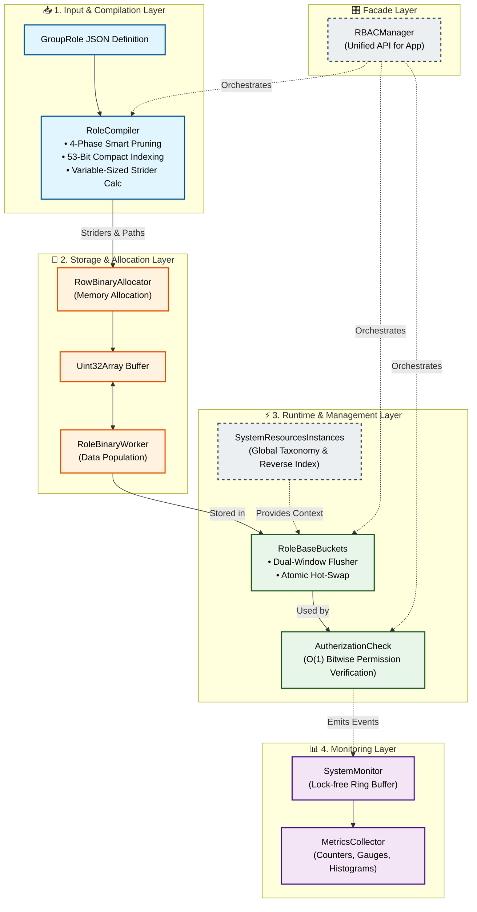
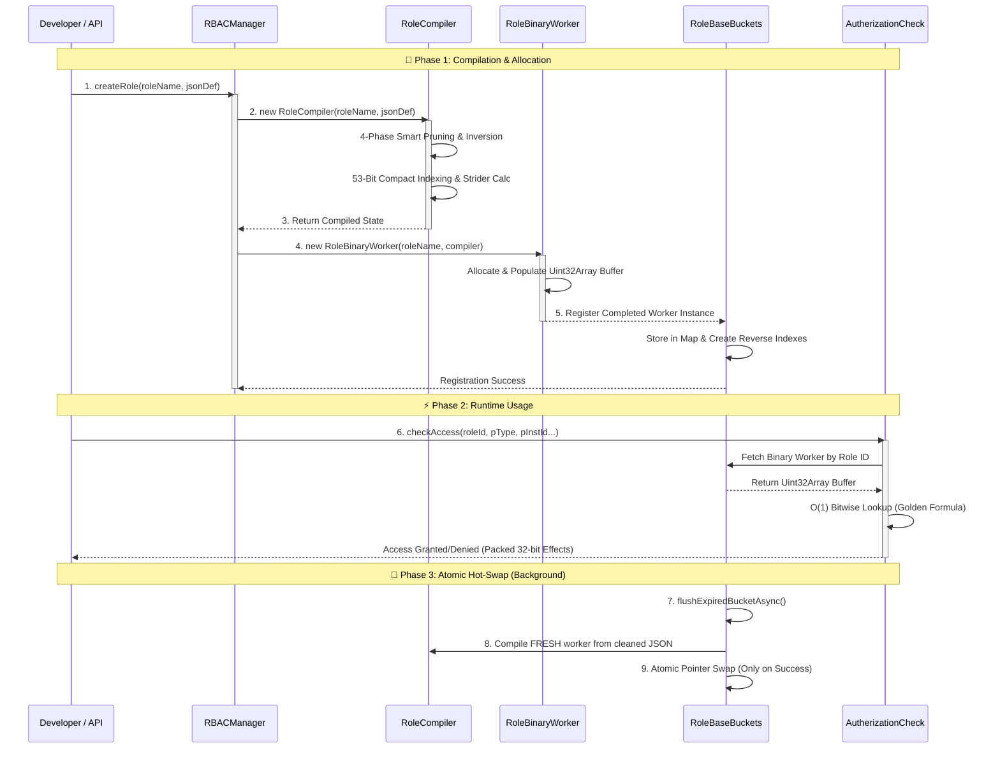
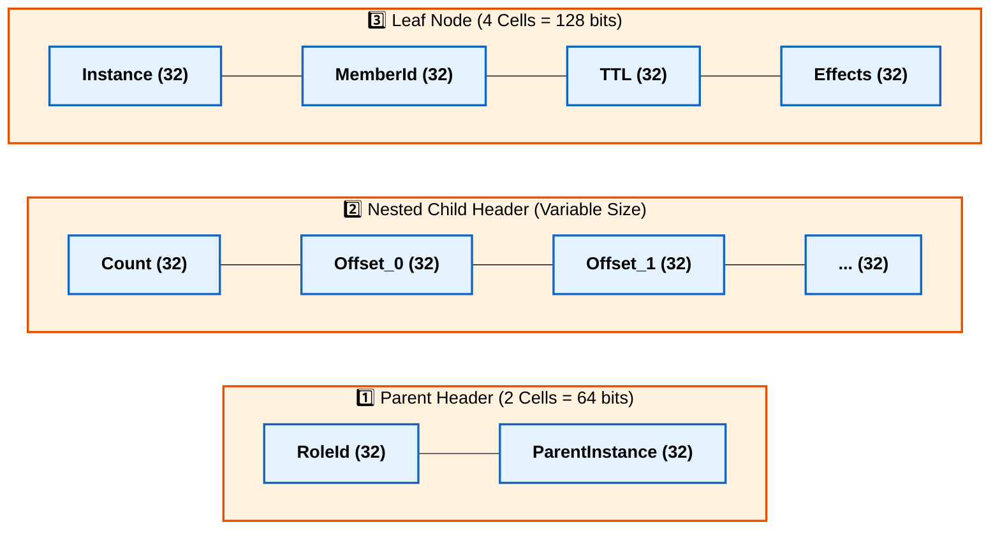

Here is the fully updated, comprehensive `README.md` that accurately reflects all the advanced optimizations, architectural upgrades, and new features we've implemented in your RBAC system.

***

# 🚀 High-Performance Binary RBAC System

An advanced, sub-microsecond Role-Based Access Control (RBAC) engine that uses **direct Binary Storage (`Uint32Array`)** to achieve ultra-high performance. It replaces traditional heavy JSON object evaluations with lightning-fast, cache-friendly bitwise memory reads, featuring enterprise-grade crash recovery and atomic hot-swapping.

## ✨ Core Features
- ⚡ **Instant O(1) Access**: Direct memory offset calculation for any permission check, bypassing object traversal entirely.
- 💾 **Variable-Sized Buffer Blueprinting**: Dynamically calculates exact byte sizes for sparse nested resources, eliminating uniform sizing memory waste.
- 🧠 **4-Phase Smart Pruning**: Advanced bitwise coverage logic (`(wildcard & specific) === specific`) automatically absorbs and deletes redundant rules during compilation.
- 🔑 **53-Bit Flattened Indexing**: Replaces deep 4-level Map nesting with 3-level flattened composite keys, reducing memory overhead by ~40% while maintaining O(1) speed.
- 🔄 **Atomic Hot-Swap**: Updates role definitions in production with zero downtime by compiling into a fresh worker and swapping pointers only on success.
- ⚙️ **Dual-Window Background Flusher**: Intelligently batches TTL expirations (Threshold: 50, or Time: 5s) to prevent event loop "flush storms".
- 🛡️ **Strict Layer Isolation**: `RoleCompiler` (staging) is strictly decoupled from `RoleBinaryWorker` (execution), guaranteeing safe, corruption-free updates.
- 🌐 **Unified 32-Bit Action Notation**: Replaces separate `action`/`boundary` arrays with packed 32-bit integers (e.g., `"RWO"`), enabling nanosecond bitwise checks.

## 🎯 Why This System?
| Metric | Traditional RBAC | Binary RBAC Engine |
| :--- | :--- | :--- |
| **Check Latency** | 1–5 ms (Object traversal) | **< 100 ns** (Bitwise memory read) |
| **Memory Footprint** | High (Heavy JSON objects) | **40–60% smaller** (Raw 32-bit integers + pruned payloads) |
| **Concurrency** | Lock contention on shared state | **Lock-free**, per-role isolated buffers |
| **Updates** | Requires cache invalidation/reload | **Atomic pointer swap** (Zero downtime) |
| **Resilience** | Volatile (lost on crash) | **Crash-Resistant** (Rebuilds instantly from persisted JSON) |

---

## 🏗️ System Architecture

The system consists of **4 fundamental layers** working in perfect harmony, orchestrated by the `RBACManager` facade.


```mermaid
flowchart TD
    classDef input fill:#e1f5fe,stroke:#01579b,stroke-width:2px,color:#000
    classDef storage fill:#fff3e0,stroke:#e65100,stroke-width:2px,color:#000
    classDef runtime fill:#e8f5e9,stroke:#1b5e20,stroke-width:2px,color:#000
    classDef monitor fill:#f3e5f5,stroke:#4a148c,stroke-width:2px,color:#000
    classDef base fill:#eceff1,stroke:#37474f,stroke-width:2px,stroke-dasharray: 5 5,color:#000

    subgraph Facade_Layer ["🎛️ Facade Layer"]
        RBACManager["RBACManager\n(Unified API for App)"]:::base
    end

    subgraph Input_Layer ["📥 1. Input & Compilation Layer"]
        direction TB
        JSON_Def["GroupRole JSON Definition"]:::input
        RoleCompiler["RoleCompiler\n• 4-Phase Smart Pruning\n• 53-Bit Compact Indexing\n• Variable-Sized Strider Calc"]:::input
        JSON_Def --> RoleCompiler
    end

    subgraph Storage_Layer ["💾 2. Storage & Allocation Layer"]
        direction TB
        RowBinaryAllocator["RowBinaryAllocator\n(Memory Allocation)"]:::storage
        Uint32Array["Uint32Array Buffer"]:::storage
        RoleBinaryWorker["RoleBinaryWorker\n(Data Population)"]:::storage
        RoleCompiler -->|Striders & Paths| RowBinaryAllocator --> Uint32Array <--> RoleBinaryWorker
    end

    subgraph Runtime_Layer ["⚡ 3. Runtime & Management Layer"]
        direction TB
        SystemResourcesInstances["SystemResourcesInstances\n(Global Taxonomy & Reverse Index)"]:::base
        RoleBaseBuckets["RoleBaseBuckets\n• Dual-Window Flusher\n• Atomic Hot-Swap"]:::runtime
        AutherizationCheck["AutherizationCheck\n(O(1) Bitwise Permission Verification)"]:::runtime
        RoleBinaryWorker -->|Stored in| RoleBaseBuckets
        SystemResourcesInstances -.->|Provides Context| RoleBaseBuckets
        RoleBaseBuckets -->|Used by| AutherizationCheck
    end

    subgraph Monitoring_Layer ["📊 4. Monitoring Layer"]
        direction TB
        SystemMonitor["SystemMonitor\n(Lock-free Ring Buffer)"]:::monitor
        MetricsCollector["MetricsCollector\n(Counters, Gauges, Histograms)"]:::monitor
        AutherizationCheck -.->|Emits Events| SystemMonitor
        SystemMonitor --> MetricsCollector
    end

    RBACManager -.->|Orchestrates| RoleCompiler
    RBACManager -.->|Orchestrates| RoleBaseBuckets
    RBACManager -.->|Orchestrates| AutherizationCheck
```

---

## 🔄 GroupRole Lifecycle Sequence


```mermaid
sequenceDiagram
    participant Dev as Developer / API
    participant Manager as RBACManager
    participant Compiler as RoleCompiler
    participant Worker as RoleBinaryWorker
    participant Buckets as RoleBaseBuckets
    participant Auth as AutherizationCheck

    Note over Dev,Auth: 🚀 Phase 1: Compilation & Allocation
    Dev->>Manager: 1. createRole(roleName, jsonDef)
    activate Manager
    Manager->>Compiler: 2. new RoleCompiler(roleName, jsonDef)
    activate Compiler
    Compiler->>Compiler: 4-Phase Smart Pruning & Inversion
    Compiler->>Compiler: 53-Bit Compact Indexing & Strider Calc
    Compiler-->>Manager: 3. Return Compiled State
    deactivate Compiler

    Manager->>Worker: 4. new RoleBinaryWorker(roleName, compiler)
    activate Worker
    Worker->>Worker: Allocate & Populate Uint32Array Buffer
    Worker-->>Buckets: 5. Register Completed Worker Instance
    deactivate Worker

    Buckets->>Buckets: Store in Map & Create Reverse Indexes
    Buckets-->>Manager: Registration Success
    deactivate Manager

    Note over Dev,Auth: ⚡ Phase 2: Runtime Usage
    Dev->>Auth: 6. checkAccess(roleId, pType, pInstId...)
    activate Auth
    Auth->>Buckets: Fetch Binary Worker by Role ID
    Buckets-->>Auth: Return Uint32Array Buffer
    Auth->>Auth: O(1) Bitwise Lookup (Golden Formula)
    Auth-->>Dev: Access Granted/Denied (Packed 32-bit Effects)
    deactivate Auth

    Note over Dev,Auth: 🔄 Phase 3: Atomic Hot-Swap (Background)
    Buckets->>Buckets: 7. flushExpiredBucketAsync()
    Buckets->>Compiler: 8. Compile FRESH worker from cleaned JSON
    Buckets->>Buckets: 9. Atomic Pointer Swap (Only on Success)
```

---

## 🧠 Core Design Principle: Separation of Concerns

| Phase | Class | Responsibility |
| :--- | :--- | :--- |
| **Definition (Static)** | `RoleCompiler` | Computes the plan: 4-Phase Pruning, Parsing, 53-Bit Indexing, and Strider calculation. |
| **Execution (Dynamic)** | `RoleBinaryWorker` | Executes the plan: Allocates memory and populates the `Uint32Array` buffer. |
| **Management (Runtime)**| `RoleBaseBuckets` | Manages active instances, reverse indexing, dual-window flushing, and atomic hot-swapping. |
| **Facade (API)** | `RBACManager` | Provides a clean, unified interface for the application, abstracting all internal complexity. |

*This separation enables zero-downtime updates, fault isolation, and independent testing of each component.*

---

## 💾 Binary Storage Philosophy

⚠️ **Critical Design Choice:** Each GroupRole has its **own separate `Uint32Array` Buffer**. Roles do *not* share a global buffer.

### Why Separate Buffers?
1. **Complete Isolation**: An error or corruption in one role's buffer cannot affect others.
2. **Atomic Hot-Swap**: You can rebuild and swap one role's buffer instantly while others continue serving requests.
3. **Flexible Memory**: Each buffer is sized exactly to the role's requirements (no massive, sparse global arrays).
4. **Cache Efficiency**: Small, cohesive buffers fit perfectly into CPU L1/L2 caches, maximizing read speed.

---

## 🧬 Core Memory Units (Within Each Buffer)

Every cell in the buffer is exactly **32 bits (4 bytes)**. The system now supports **variable-sized nested children** via dynamic offset tables.


```mermaid
flowchart LR
    subgraph ParentHeader ["1️⃣ Parent Header (2 Cells = 64 bits)"]
        direction LR
        PH1["RoleId (32)"] --- PH2["ParentInstance (32)"]
    end
    subgraph NestedHeader ["2️⃣ Nested Child Header (Variable Size)"]
        direction LR
        NC1["Count (32)"] --- NC2["Offset_0 (32)"] --- NC3["Offset_1 (32)"] --- NC4["... (32)"]
    end
    subgraph LeafNode ["3️⃣ Leaf Node (4 Cells = 128 bits)"]
        direction LR
        LN1["Instance (32)"] --- LN2["MemberId (32)"] --- LN3["TTL (32)"] --- LN4["Effects (32)"]
    end
    classDef cell fill:#e3f2fd,stroke:#1565c0,stroke-width:2px,color:#000,font-weight:bold;
    class PH1,PH2,NC1,NC2,NC3,NC4,LN1,LN2,LN3,LN4 cell;
    classDef sub fill:#fff3e0,stroke:#e65100,stroke-width:2px,color:#000;
    class ParentHeader,NestedHeader,LeafNode sub;
```

### Detailed Cell Breakdown
| Unit | Size | Contents | Description |
| :--- | :---: | :--- | :--- |
| **Parent Header** | 2 Cells | `[RoleId, ParentInstance]` | Identifies the role and the parent resource instance. |
| **Nested Header** | `1 + N` Cells | `[Count, Offset_0, Offset_1, ...]` | Acts as a dynamic offset table. Exists *only* when grandchildren are present. |
| **Leaf Node** | 4 Cells | `[Instance, MemberId, TTL, Effects]` | Holds the actual permission data. *Always 4 cells, whether direct Child or GrandChild.* |

---

## 📐 Two Possible Structure Cases

### Case 1: Direct Child Leaf (No GrandChild)
*Total Size = 6 Cells*
```text
┌────────────────────────────────────────────┐
│ Parent Header (2) │ Child Leaf (4)         │
│ [RoleId, ParIns]  │ [Ins, Mem, TTL, Eff]   │
└────────────────────────────────────────────┘
```

### Case 2: Nested Child + GrandChild Leaf (Variable-Sized)
*Total Size = 2 (Parent) + 1+Count (Nested Header) + 4 (GrandChild Leaf)*
```text
Assume 2 Grandchild Instances:
┌────────────────────────────────────────────────────────────────┐
│ Parent (2) │ Nested Header (3)      │ GrandChild Leaf 0 (4)   │
│ [RoleId,   │ [Count=2, Offset_0,    │ [Ins, Mem, TTL, Eff]    │
│  ParIns]   │  Offset_1]             │                         │
├────────────────────────────────────────────────────────────────┤
│ GrandChild Leaf 1 (4)                                          │
│ [Ins, Mem, TTL, Eff]                                           │
└────────────────────────────────────────────────────────────────┘
```

---

## 🧮 The Golden Formula for O(1) Access

To read any cell within a role's buffer, the engine uses a deterministic mathematical formula.

### For Direct Children:
```javascript
address = shift + striderOffset[type] + (striderSize[type] × instanceIndex)
```

### For Nested Grandchildren (Dynamic Offset Lookup):
```javascript
// 1. Find the Nested Header address
childAddr = shift + striderOffset[childType]

// 2. Read the count and the specific offset for this instance
count = buffer[childAddr]
childShift = buffer[childAddr + 1 + childInstanceIndex]

// 3. Calculate the final GrandChild Leaf address
finalAddr = childAddr + count + childShift

// 4. Read the 4-cell Leaf Node
instance  = buffer[finalAddr]
memberId  = buffer[finalAddr + 1]
ttl       = buffer[finalAddr + 2]
effects   = buffer[finalAddr + 3]
```

| Element | Meaning | Example |
| :--- | :--- | :--- |
| `shift` | Start point of the ParentInstance block within the buffer. | `0` for first Parent, `15` for second. |
| `striderOffset[type]` | Internal offset to reach the specific Resource type. | `0` for Parent, `2` for Child Leaf. |
| `striderSize[type]` | Resource block size (how many cells it occupies). | `2` for Parent, `4` for Leaf. |
| `instanceIndex` | The requested instance number. | `0`, `1`, `2`, ... |

---

## 🃏 Wildcard as a Marker (Not an Index)

The system uses `4294967295` (`0xFFFFFFFF`) as a special numeric marker for wildcards, avoiding string comparisons entirely.

```text
┌─────────────────────────────────────────────────────────────┐
│ Case 1: Wildcard Marker in Leaf Node                        │
│ Buffer: [4294967295, 1, 1787618024, 4259861]                │
│          ↑                                                  │
│     Wildcard marker (means: applies to ALL instances)       │
│                                                             │
│ Request: checkAccess(roleId, parentId, instance=5)          │
│ Result: ✅ Allowed (Engine detects 0xFFFFFFFF and bypasses) │
├─────────────────────────────────────────────────────────────┤
│ Case 2: Specific Instance in Leaf Node                      │
│ Buffer: [1, 2, 1787618024, 65]                              │
│          ↑                                                  │
│     Specific instance (means: applies to instance 1 only)   │
│                                                             │
│ Request: checkAccess(roleId, parentId, instance=1)          │
│ Result: ✅ Allowed (1 === 1)                                │
└─────────────────────────────────────────────────────────────┘
```

---

## ⚙️ The 6-Phase Data Flow

1. **JSON Definition**: User provides plain JSON via `RBACManager`. No memory allocated yet.
2. **Validation**: Checks `TYPE_IDS`, hierarchy (`RESOURCES_CHILD`), wildcard mixing, and non-empty arrays. *Fails fast if invalid.*
3. **4-Phase Smart Pruning**: Explodes multi-instance parents, inverts the data structure, normalizes actions to 32-bit bitmasks, and prunes redundant wildcard rules.
4. **Buffer Staging & Compact Indexing**: Assigns `0`-based relative compact indices using 53-bit flattened keys and writes 10-element blocks to the `_pathsBuffer`.
5. **Variable-Sized Strider Calculation**: Computes exact `striderSize` and `striderOffset` for every node, including dynamic offset tables for nested children, determining the final `totalBytesSize`.
6. **Runtime (`AutherizationCheck`)**: Fetches the worker, calculates the address using the Golden Formula, reads the 4 cells, checks TTL, and returns the bitwise `Effects`.

---

## 🧱 Philosophy of Constants

In high-performance systems, string comparison is a "performance killer." This system relies entirely on **Integers** and **Static Maps**.

| Constant Map | Purpose | Example |
| :--- | :--- | :--- |
| **`TYPE_IDS`** | Maps resource names to unique numeric PIDs. | `COLLECTIONS: 100`, `DOCUMENTS: 101` |
| **`RESOURCES_CHILD`** | The "Law of Parenthood". Defines valid hierarchies. | `Map([100, Set([102])])` (COLLECTIONS → SEARCH_INDEXES) |
| **`STRIDER_SIZES`** | The memory map governing cell sizes. | `PARENT: 2`, `CHILD: 4`, `NESTED: 1` |
| **`EFFECT_ACTION`** | Unified 32-bit packed action + boundary notations. | `RWO: 49` (READ|WRITE + OWN) |
| **`SYSTEM_STATUS`** | Standardized numeric error codes. | `INVALID_RESOURCE_PID: -11` |

### Bitmasking for Actions & Boundaries
Permissions are compressed into a single **32-bit `Effects` cell**:
- **Least Significant 2 Bytes**: Primary `action` (READ=1, WRITE=2) + `boundary` (OWN=16, ALL=64).
- **Most Significant 2 Bytes**: Delegated `actionToOthers` + `boundaryToOthers`.

```javascript
// Example: READ (1) | OWN (16) = 17
// Shifted for delegation: (WRITE (2) | ALL (64)) << 16 = 4325376
// Total Effect = 4325376 | 17 = 4325393
```

---

## 🚀 Quick Start & API Reference

### 1. Initialize the System
```javascript
import { rbacManager } from './rbac/RBACManager.js';

// Initialize RBAC Manager (wires into monitoring automatically)
rbacManager.initialize({ monitoring: { enabled: true } });
console.log('✅ RBAC System is ready!');
```

### 2. Register Resources & Instances
```javascript
// Register Parent Resource: COLLECTIONS
rbacManager.registerResource('COLLECTIONS', ['users_collection', 'posts_collection']);

// Register Child Resource: SEARCH_INDEXES
rbacManager.registerResource('SEARCH_INDEXES', ['idx_user_email', 'idx_post_title']);
```

### 3. Create a Role (Using Unified Notation)
```javascript
const editorRoleDefinition = {
    "editor_member": {
        "SEARCH_INDEXES": {
            parentResource: "COLLECTIONS",
            parentInstance: ["users_collection"],
            action: "RWO",           // ✅ Unified: Read + Write + Own
            actionToOthers: "RO",    // ✅ Unified: Read + Own (for others)
            ownerInstance: [
                { name: "user_1", ttl: "24h" }, // ✅ Per-owner TTL
                { name: "user_2", ttl: "7d" }
            ],
            nested: "SEARCH_INDEXES",
            nestedInstance: ["idx_user_email"]
        }
    }
};

const result = rbacManager.createRole("EDITOR_ROLE", editorRoleDefinition);
if (result.success) {
    console.log(`✅ Role created! Role ID: ${result.roleId}`);
}
```

### 4. Check Access (Runtime Authorization)
```javascript
import { DEFAULT_ACTIONS } from './rbac/constant/resourceType.js';

const userRoleId = 1; // Fetched from user session
const parentType = 100; // TYPE_IDS.COLLECTIONS
const parentInstance = 0; // Index of 'users_collection'
const childType = 102;    // TYPE_IDS.SEARCH_INDEXES
const childInstance = 0;  // Index of 'idx_user_email'

// 1. Perform the O(1) check
const accessEffect = rbacManager.checkAccess(
    userRoleId, parentType, parentInstance, childType, childInstance
);

// 2. Evaluate the result
if (typeof accessEffect === 'object' && accessEffect.code) {
    console.log(`🚫 Access Denied: ${accessEffect.message}`);
} else {
    // Access Granted! Check if the specific action is allowed
    const canRead = rbacManager.allowedPrimaryTarget(accessEffect, DEFAULT_ACTIONS.READ);
    const canWrite = rbacManager.allowedPrimaryTarget(accessEffect, DEFAULT_ACTIONS.WRITE);
    
    console.log(`✅ Access Granted! Can Read: ${canRead}, Can Write: ${canWrite}`);
}
```

### 5. Atomic Hot-Swap (Zero-Downtime Update)
```javascript
const updatedEditorDefinition = { /* ... updated JSON ... */ };

// Perform Atomic Hot-Swap
const updateResult = rbacManager.updateRole("EDITOR_ROLE", updatedEditorDefinition);

if (updateResult.success) {
    console.log('✅ Role updated instantly! Old buffer discarded, new buffer active.');
}
```

### 6. Safe Resource Deletion
```javascript
// Attempt to delete 'users_collection'
const deleteResult = rbacManager.deleteInstance('COLLECTIONS', 'users_collection');

if (!deleteResult.success) {
    console.warn(`⚠️ Cannot delete: ${deleteResult.message}`);
    // Resolution: Update or delete the blocking roles first, then retry.
}
```

---

## ⚠️ Best Practices & Common Mistakes

| ✅ Best Practice | ❌ Common Mistake |
| :--- | :--- |
| **Use the `RBACManager` Facade**: It abstracts complexity and ensures safe orchestration. | Directly instantiating `RoleCompiler` or `RoleBinaryWorker` without understanding the lifecycle. |
| **Use Unified Notation**: `"RWO"` instead of `action: ["READ"], boundary: "OWN"`. | Using legacy separate action/boundary arrays (increases memory and compilation time). |
| **Leverage Wildcards Wisely**: `parentInstance: ["*"]` for broad access. | Mixing `"*"` with specific instances: `["*", 0, 1]` (Rejected by validation). |
| **Set Realistic Per-Owner TTLs**: Use `"24h"` for temp access, `0` or `null` for permanent. | Using `"999d"` for "temporary" access. |
| **Respect Hierarchy**: Follow `RESOURCES_CHILD` rules strictly. | Trying to make a Leaf resource (e.g., `COMMENT`) a parent. |
| **Minimize Instances**: Fewer instances = smaller, faster buffers. | Defining 1,000 specific instances instead of one `"*"` wildcard. |

---

## 📊 Performance Monitoring

The system is deeply instrumented. You can pull real-time metrics to ensure optimal performance.

```javascript
import { getMetricsSnapshot } from "./Monitoring/monitoringSystem.js";

const snapshot = getMetricsSnapshot();
console.log('\n📊 RBAC Performance Metrics:');
console.log(`Total Auth Checks: ${snapshot.metrics.counters['rbac.access.check.total'] || 0}`);

const durationHist = snapshot.metrics.histograms['rbac.access.check.duration'];
if (durationHist) {
    console.log(`Avg Check Time: ${durationHist.avg} ns`); // Target: < 100ns
    console.log(`99th Percentile: ${durationHist.p99} ns`);
}
```

### 🎯 Critical Metrics Thresholds
| Metric | Ideal Value | Action if Exceeded |
| :--- | :--- | :--- |
| **Avg Check Time** | `< 100 ns` | Review role structure for excessive nesting. |
| **Buffer Size** | `< 10 KB` per role | Reduce instance count; use wildcards. |
| **Compile Time** | `< 10 ms` | Review Validation logic for large JSON payloads. |
| **Hot-Swap Time** | `< 50 ms` | Normal. If higher, check background worker load. |

---

**Version:** 2.0.0 (Enterprise Optimized)  
**Last Updated:** 2026-10-10  
**Architecture:** Binary-Compiled, Zero-GC, Crash-Resistant RBAC  
**Related Docs:**
- [More About How Resource are register to RBAC system](https://github.com/Elnsor/native-mongo-odm/blob/main/doc/adr/019-rbac-SystemResourcesInstances.md)
- [Useing RoleBuilder Class for Generate Role Deffinition](https://github.com/Elnsor/native-mongo-odm/blob/main/src/rbac/builder/README.md)
- [More About 4-Phase Smart Pruning:](https://github.com/Elnsor/native-mongo-odm/blob/main/doc/adr/022-rbac-RoleCompiler-expolde-schemaSlices.md)
- [More About How Role Compiled](https://github.com/Elnsor/native-mongo-odm/blob/main/doc/adr/021-rbac-update-RoleCompile.md)
- [More About How Role Register To System and How Role revoce When its Expire](https://github.com/Elnsor/native-mongo-odm/blob/main/doc/adr/020-rbac-RoleBaseBuckets.md)
- [More About Effected Action Notation](https://github.com/Elnsor/native-mongo-odm/blob/main/doc/adr/023-rbac-EFFECTED_ACTIONS.md)
